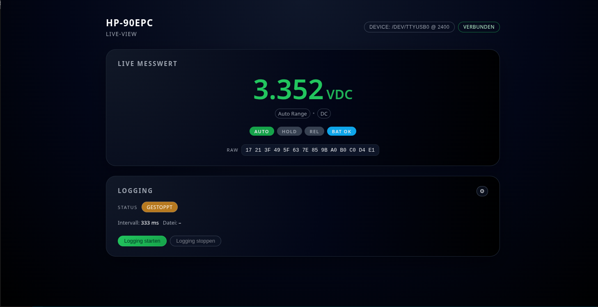

# Go4-HP-90EPC (v1)

Compact HTTP server and Web UI for the **HP‑90EPC serial multimeter**, with live display and CSV logging.  
Forks and adaptations for other meters are explicitly welcome.



---

## What this project is (and is not)

This tool reads the **raw serial data stream** of the HP‑90EPC multimeter, decodes frames in near real‑time,
and exposes the data via a small HTTP server with a browser‑based UI.

It is intentionally:
- **Simple** (single binary, no external runtime)
- **Hackable** (clean Go packages, easy to fork)
- **Device‑centric** (no cloud, no telemetry, no nonsense)

It is **not** meant to be:
- A generic SCPI framework
- A heavy monitoring stack
- A closed “end‑user product”

If you own a similar multimeter: **fork it and adapt the decoder**.
If you are a device manufacturer and want to collaborate or provide test hardware, feel free to get in touch.
---

## Highlights

- Stream‑based serial parser (no blocking `readExact` loops)
- Near real‑time updates (very close to the device LCD)
- Robust reconnect logic (USB unplug / power off safe)
- Stale‑based connection detection (`connected` is derived, not guessed)
- Embedded Web UI (no external files needed)
- Live value + unit + mode (AC/DC/°C/etc.)
- Raw hex frame display (debugging & reverse‑engineering friendly)
- CSV logging with configurable interval
- Log file browser, download and tail via UI
- Persistent configuration per OS
- Clean separation: reader / logger / server / UI

---

## Build

```bash
go build -o hp90epc
```

### Cross‑compile examples

```bash
GOOS=windows GOARCH=amd64 go build -o hp90epc.exe
GOOS=darwin  GOARCH=amd64 go build -o hp90epc-macos-amd64
GOOS=darwin  GOARCH=arm64 go build -o hp90epc-macos-arm64
GOOS=linux   GOARCH=amd64 go build -o hp90epc-linux-amd64
```

---

## Run

```bash
./hp90epc
```

The browser opens automatically unless disabled.

### Useful flags

- `--port`  
  Serial device  
  Examples:
  - Linux: `/dev/ttyUSB0`, `/dev/ttyACM0`
  - macOS: `/dev/tty.usbserial-*`, `/dev/cu.usbserial-*`
  - Windows: `COM3`, `COM4`

- `--baud`  
  Serial baud rate (default: `2400`)

- `--http`  
  HTTP listen address (default: `:8080`)

- `--logdir`  
  Directory for CSV log files

- `--log-interval-ms`  
  Logging interval in milliseconds

- `--appdir`  
  Force application directory for config and logs

- `--portable`  
  Store config and logs next to the binary

- `--no-browser`  
  Do not auto‑open the browser

---

## Configuration

Configuration is written automatically on change.

Default locations:

- **Linux**  
  `~/.config/hp90epc/config.json`

- **macOS**  
  `~/Library/Application Support/hp90epc/config.json`

- **Windows**  
  `%AppData%\hp90epc\config.json`

Stored values include:
- Device port
- Baud rate
- HTTP address
- Log directory
- Log interval

---

## Logging

- File format: CSV
- Filename pattern:  
  `hp90epc_YYYY-MM-DD_HH-MM-SS.csv`
- One row per accepted measurement
- Interval‑based throttling (no duplicate spam)

### UI features
- Start / stop logging
- Change interval
- List existing log files
- Download CSV
- Tail last *n* lines directly in the browser

### API endpoints
- `/api/log/status`
- `/api/log/start`
- `/api/log/stop`
- `/api/log/interval`
- `/api/log/files`
- `/api/log/file`
- `/api/log/tail`

---

## API Quick Reference

- **Live measurement**  
  `GET /api/live`

- **Reader status**  
  `GET /api/reader/status`  
  Includes port, baud, last frame timestamp and derived `connected` state

- **Hot‑swap device**  
  `POST /api/device/port`  
  ```json
  { "port": "/dev/ttyUSB0", "baud": 2400 }
  ```

---

## Supported units (current decoder)

- V / mV / µV
- A
- Ω
- Hz
- F
- %
- °C
- AC / DC modes
- Hold / Rel / Low battery flags

(See `reader/decodeFrame()` if you want to extend this.)

---

## Motivation

There was no clean, open, hackable solution for this multimeter.  
Now there is.

If you:
- own the same device
- want to adapt it to a similar one
- or just enjoy clean Go tooling

→ **fork it**.

---

## License

MIT License

Copyright (c) 2025  
**Andreas Pirsig – Reset42**

Forks, modifications and adaptations are explicitly welcome.
